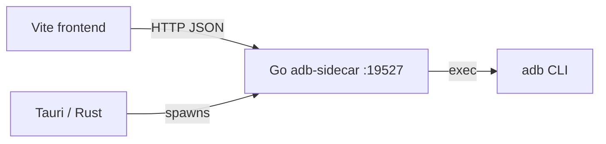

# ADB Tauri

Desktop app: **Tauri 2** (Rust shell + web UI) + **Go sidecar** (ADB logic over HTTP).

Same features as [`adb-ssr`](../adb-ssr/README.md) / [`adb-desktop`](../adb-desktop/README.md): devices, remote keys, text/tap, shell, app list, close all apps.

## Architecture



## Requirements

- [Node.js](https://nodejs.org/) 18+
- [Rust](https://rustup.rs/)
- [Go](https://go.dev/) 1.22+
- `adb` on PATH or Android SDK `platform-tools`

## Quick start (development)

**Terminal 1** — Go API:

```bash
cd june/adb-tauri
npm install
npm run sidecar
```

**Terminal 2** — Tauri + Vite (build sidecar binary first for bundled spawn):

```bash
cd june/adb-tauri
chmod +x scripts/build-sidecar.sh
npm run build:sidecar
npm run tauri dev
```

The UI talks to `http://127.0.0.1:19527`. In dev, run `npm run sidecar` so the API is up before using the window.

## Build installers

```bash
npm run tauri:build
```

Builds the Go sidecar for your OS, then packages the Tauri app under `src-tauri/target/release/bundle/`.

## Go sidecar API

| Method | Path | Description |
|--------|------|-------------|
| GET | `/api/health` | Sidecar + adb path |
| GET/POST | `/api/config` | Host / serial |
| GET | `/api/devices` | `adb devices -l` |
| POST | `/api/connect` | Network connect |
| POST | `/api/key` | Key event |
| GET | `/api/apps` | Third-party packages |
| POST | `/api/apps/close-all` | Force-stop all |

Port: `ADB_SIDECAR_PORT` (default `19527`).

## Related

- Browser SSR: [`june/adb-ssr`](../adb-ssr/README.md)
- Electron: [`june/adb-desktop`](../adb-desktop/README.md)
