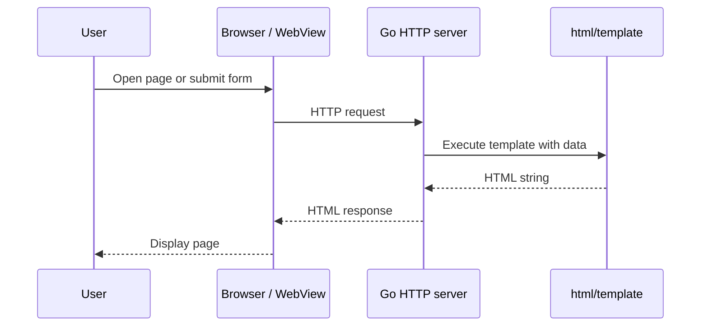

# What is SSR (Server-Side Rendering)?

## Definition

**Server-Side Rendering (SSR)** means the **server** turns data + templates into **HTML** before the client shows the page.

The client receives **ready-made HTML**, not a blank page that must fetch JSON and build the DOM in JavaScript (typical **CSR**, Client-Side Rendering).

## In this repo

`indexHandler` in `main.go` is SSR:

1. Read query params (`name`)
2. Build `PageData`
3. Run `templates/index.html` through `html/template`
4. Write HTML to the HTTP response

The user sees “Hello, World!” (or another name) **because the server already put that text into the HTML**.

## SSR vs CSR (quick)

| | SSR | CSR (SPA) |
|---|-----|-----------|
| First HTML | Full page from server | Often almost empty shell |
| Data on first paint | Usually in HTML or server-injected | Fetched via API after load |
| SEO / no-JS | Easier with real HTML | Harder without extra setup |
| Interactivity | Can add JS; many apps hybrid | Heavy JS framework |

## SSR is not the same as “a website”

SSR describes **where HTML is produced**. You can use SSR for:

- Public websites (nginx → Go → browser)
- Internal admin tools
- **Desktop apps** that embed a webview (this project)

The next doc compares **SSR on the web** vs **SSR inside a desktop app**.
