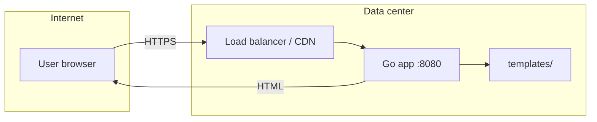
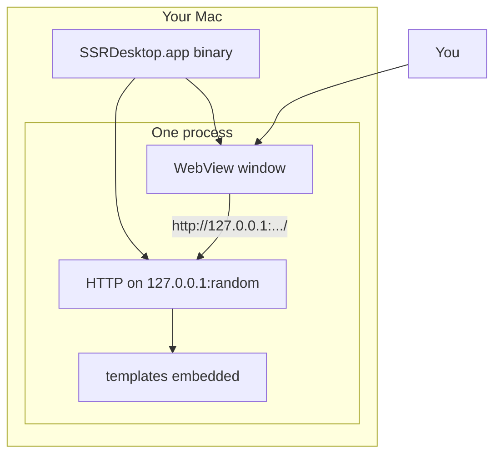

# SSR Web vs SSR Desktop App

Both can use the same stack (Go, `html/template`, CSS). The **difference is the delivery shell**: public browser vs native app window.

## Side-by-side

| Dimension | SSR **web** app | SSR **desktop** app (e.g. `SSRDesktop.app`) |
|-----------|-----------------|---------------------------------------------|
| **Client** | Chrome, Safari, Firefox | Native window (here: macOS WebKit via `webview_go`) |
| **How user opens it** | URL (`https://example.com`) | Double-click `.app`, Dock, Spotlight |
| **Server location** | Remote VPS, cloud, office server | Usually **same machine** as the UI |
| **Network** | Internet or LAN; often TLS, DNS, load balancers | Almost always **`127.0.0.1` + random port** (loopback only) |
| **Who can connect** | Anyone with network access (unless firewalled) | Typically **only this app’s webview** on your Mac |
| **Distribution** | Deploy server; users need no install (or PWA) | Ship **binary / `.app` bundle** + icon |
| **Updates** | Redeploy server; users get changes on refresh | User reinstalls or auto-update mechanism you build |
| **Offline** | Needs server reachable | Can work offline if server is local and embedded |
| **OS integration** | Limited (tabs, bookmarks) | Icon, Dock, window chrome, future: menus, notifications |
| **SSR code** | Handlers + templates | **Same** handlers + templates possible |

## Architecture diagrams

### SSR web (classic)

- Browser and server are **different machines** (usually).
- Many users, one (or many) servers.
- Security: auth, HTTPS, rate limits, OWASP concerns.

### SSR desktop (this project’s pattern)

- “Browser” is **inside the app** (WebView).
- HTTP server is a **implementation detail** to reuse HTML/CSS/SSR—you could render HTML and call `webview` APIs instead, but local HTTP keeps one codebase for web and desktop experiments.

## What stays the same

- Templates (`templates/index.html`)
- Static assets (`static/style.css`)
- Request → handler → template → HTML
- Forms (`GET /?name=...`) and server round-trips

If you moved `indexHandler` to a cloud server, the **SSR logic** could be copied with little change.

## What changes

| Concern | Web | Desktop (`ssrdesktop`) |
|---------|-----|-------------------------|
| **Binding** | `0.0.0.0:8080` or behind reverse proxy | `127.0.0.1:0` (localhost only) |
| **Lifecycle** | Server runs 24/7 | Server starts when app opens, stops when app quits |
| **Assets** | Files on disk or CDN | `//go:embed` in binary |
| **Packaging** | Docker, systemd, k8s | `build.sh` → `.app` + `AppIcon.icns` |
| **User trust** | You trust the **host** | You trust the **installed app** |

## Common confusion

### “Desktop app = no server?”

**No.** This desktop app **includes** a small HTTP server. It is not a static `.html` file on disk opened by Safari—it is **SSR** because Go renders HTML per request.

### “WebView = just a website?”

The UI **looks** like a website (HTML/CSS). Runtime is **not** a public website: no domain, no remote host (unless you change the code to point elsewhere).

### “SSR desktop = Electron?”

Similar **idea** (native shell + web tech). This project uses **Go + webview** instead of Node + Chromium—smaller binary, different ecosystem, same “local server + embedded browser” pattern many tools use.

## When to choose which

| Choose **SSR web** when | Choose **SSR desktop** when |
|-------------------------|-----------------------------|
| Many users, central updates | Single-user tool on macOS/Windows/Linux |
| SEO and shareable URLs matter | No public URL needed |
| No install friction | Need Dock icon, feels like “real app” |
| Server already exists | Work offline or with local files |
| Team ops can run servers | Users won’t run `go run` themselves |

## Hybrid

Many products do **both**: same Go handlers, web deployment for customers, Wails/webview build for power users. `ssrdesktop` is a minimal hello-world of that split.
