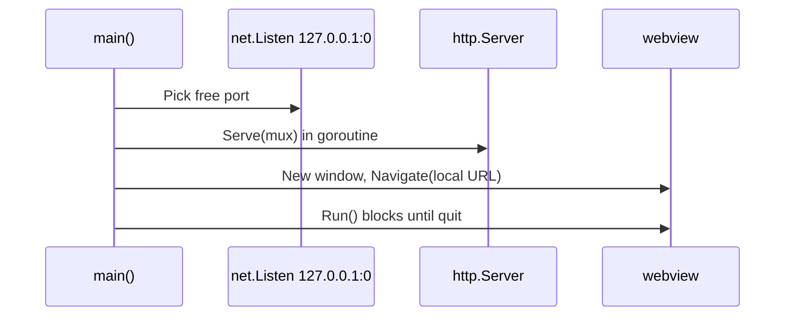
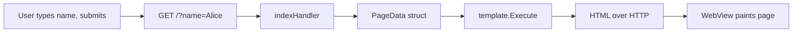

# How `may/ssrdesktop` Works (Step by Step)

Map from source files to the ideas in [02-ssr-web-vs-desktop.md](02-ssr-web-vs-desktop.md).

## Startup (`main.go`)



1. **`net.Listen("tcp", "127.0.0.1:0")`** — Only localhost; port `0` means OS assigns a free port (not `:8080` on all interfaces like a public web server).
2. **HTTP server in a goroutine** — Serves embedded `static/` and SSR route `/`.
3. **`webview.Navigate(url)`** — Window loads `http://127.0.0.1:<port>/` (the webview acts like a tiny browser).
4. **`w.Run()`** — UI event loop; app exits when window closes.

## One page request (SSR)



Relevant code path:

- Query: `r.URL.Query().Get("name")`
- Data: `PageData{ Message: "Hello, Alice!", ... }`
- Template: `template.ParseFS(templateFS, "templates/index.html")`
- Response: `Content-Type: text/html`

That is **identical SSR** to `may/guide-CLI` or any Go web app—only the **client** is a webview, not Safari visiting `:8080` on your LAN.

## Embedded files (`//go:embed`)

```go
//go:embed templates/*
var templateFS embed.FS

//go:embed static/*
var staticFS embed.FS
```

| Web deployment | This desktop app |
|----------------|------------------|
| Read `templates/` from disk on server | Templates compiled **into the binary** |
| `http.Dir("static")` | `http.FS(staticSub)` from embed |

Benefit for desktop: one `.app` file, no missing `templates/` folder beside the binary.

## Packaging (`build.sh`)

| Output | Purpose |
|--------|---------|
| `build/SSRDesktop` | Mach-O binary (CGO + WebKit) |
| `build/AppIcon.icns` | macOS icon from `assets/icon.png` |
| `build/SSRDesktop.app` | Bundle: `Contents/MacOS/`, `Resources/`, `Info.plist` |

Web SSR does not need `Info.plist` or `.icns`; desktop does for Finder/Dock branding.

## If this were a normal SSR **web** app

Change only the **shell** (conceptually):

| Line / idea | Web version |
|-------------|-------------|
| `127.0.0.1:0` | `":8080"` or deploy behind nginx |
| `webview` block | **Remove** — user opens browser manually |
| `go:embed` | Optional; often files on server |
| `build.sh` → `.app` | `docker build` / `systemctl` / CI deploy |

Keep `indexHandler` and templates the same.

## File map

```
may/ssrdesktop/
├── main.go              ← local server + webview + SSR handler
├── templates/index.html ← server-rendered page
├── static/style.css     ← served as /static/style.css
├── assets/icon.png      ← desktop-only branding
├── build.sh             ← desktop-only packaging
└── learn/               ← you are here
```
