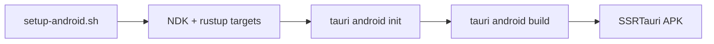

# SSRTauri → Android APK

## One codebase

`src-tauri/src/lib.rs` runs on **macOS** and **Android**:

- Axum SSR on `127.0.0.1`
- Tauri window → that URL
- Same `templates/` + `static/`

## Build pipeline

## Scripts

| Script | Purpose |
|--------|---------|
| `setup-android.sh` | SDK cmdline-tools, NDK, `rustup target add …-linux-android` |
| `build-android.sh` | init (if needed) + debug APK → `build/` |
| `share-android.sh` | zip for friend / TV box |

## vs `ssrapk`

Use **ssrapk** for fastest TV-box hello APK (Kotlin, smaller toolchain).

Use **ssrtauri Android** when you want **Rust SSR on Mac and APK** from one project.

## Blocker: disk space

NDK + Rust `aarch64-linux-android` std need **~3GB+** free.

If install fails: free space, then `./setup-android.sh` again.
